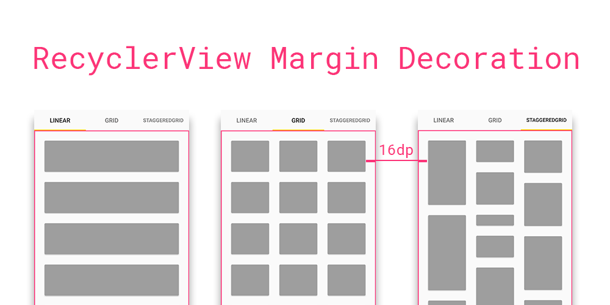

# **「 RecyclerView Margin Decoration 」**




A library for add margin each item in RecyclerView.


## 「 Installation 」

Maven
```xml
<dependency>
  <groupId>com.github.thekhaeng</groupId>
  <artifactId>recycler-margin</artifactId>
  <version>1.0.0</version>
  <type>pom</type>
</dependency>
```

Gradle
```gradle
compile ('com.github.thekhaeng:recycler-margin:1.0.0') {
    exclude group: 'com.android.support', module: 'recyclerview-v7'
}
```

## 「 Usage 」

### For LinearLayoutManager
```java
recyclerView.addItemDecoration( new LinearLayoutMargin( spaceInPx ) );

or

recyclerView.addItemDecoration( new DefaultLayoutMargin( 1, spaceInPx, true ) );
```

### For GridLayoutManager
```java
recyclerView.addItemDecoration( new GridLayoutMargin( yourSpan, spaceInPx ) );

or

recyclerView.addItemDecoration( new DefaultLayoutMargin( yourSpan, spaceInPx, true ) );
```

### For StaggeredGridLayoutManager
```java
recyclerView.addItemDecoration( new StaggeredGridLayoutMargin( yourSpan, spaceInPx ) );

or

recyclerView.addItemDecoration( new DefaultLayoutMargin( yourSpan, spaceInPx, true ) );
```


# Licence

Copyright 2017 TheKhaeng

Licensed under the Apache License, Version 2.0 (the "License"); you may not use this work except in compliance with the License. You may obtain a copy of the License in the LICENSE file, or at:

http://www.apache.org/licenses/LICENSE-2.0

Unless required by applicable law or agreed to in writing, software distributed under the License is distributed on an "AS IS" BASIS, WITHOUT WARRANTIES OR CONDITIONS OF ANY KIND, either express or implied. See the License for the specific language governing permissions and limitations under the License.


### Developed By Thai android developer.


Follow [facebook.com/thekhaeng.io](https://www.facebook.com/thekhaeng.io) on Facebook page.
or [@nonthawit](https://medium.com/@nonthawit) at my Medium blog. :)

For contact, shoot me an email at nonthawit.thekhaeng@gmail.com


